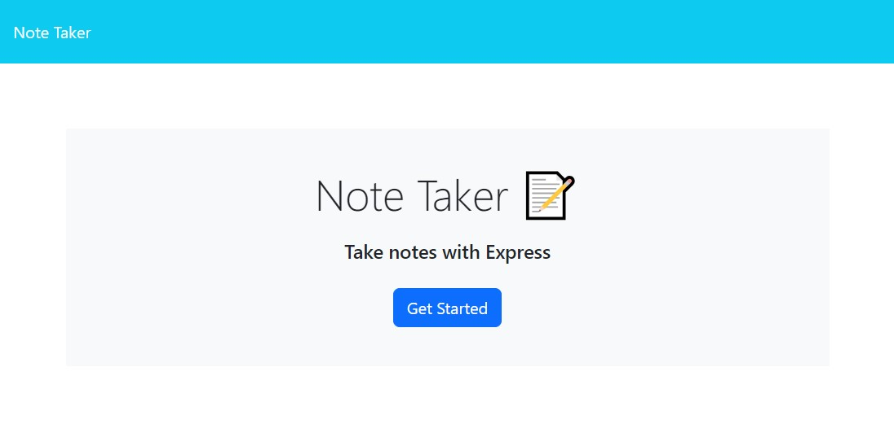
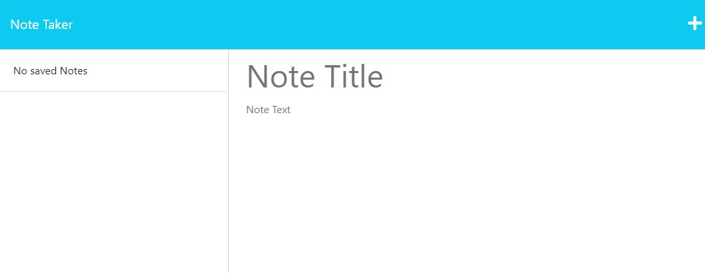
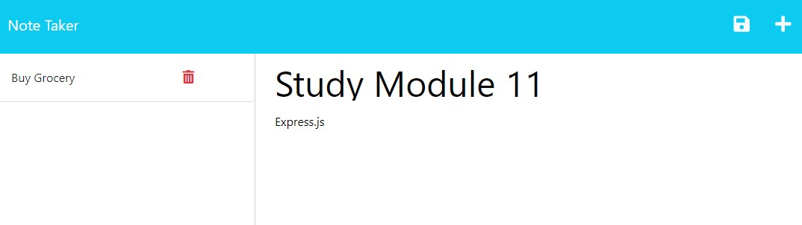

# Note Taking APP
This is application for users to write, save and delete simple notes.

## Description
- Open the [App](https://stark-plateau-74315-454ff016d3ca.herokuapp.com/)
- WHEN you open the Note Taker
- THEN you am presented with a landing page with a link to a notes page
- WHEN you click on the link to the notes page
- THEN you am presented with a page with existing notes listed in the left-hand column, plus empty fields to enter a new note title and the note’s text in the right-hand column
- WHEN you enter a new note title and the note’s text
- THEN a Save icon appears in the navigation at the top-right of the page
- WHEN you click on the Save icon
- THEN the new note I have entered is saved and appears in the left-hand column with the other existing notes
- WHEN you click on an existing note in the list in the left-hand column
- THEN that note appears in the right-hand column
- WHEN you click on the Plus `+` icon in the navigation at the top-right of the page
- THEN you am presented with empty fields to enter a new note title and the note’s text in the right-hand column
- When you click on the Trash Can icon next to a saved note
- Then the note will be deleted from the left-hand column

## Screenshot

## Technology Used
- HTML
- Bootstrap
- JavaScript
- [node.js](https://nodejs.org/en/download)
- [express.js](https://expressjs.com)

## License

